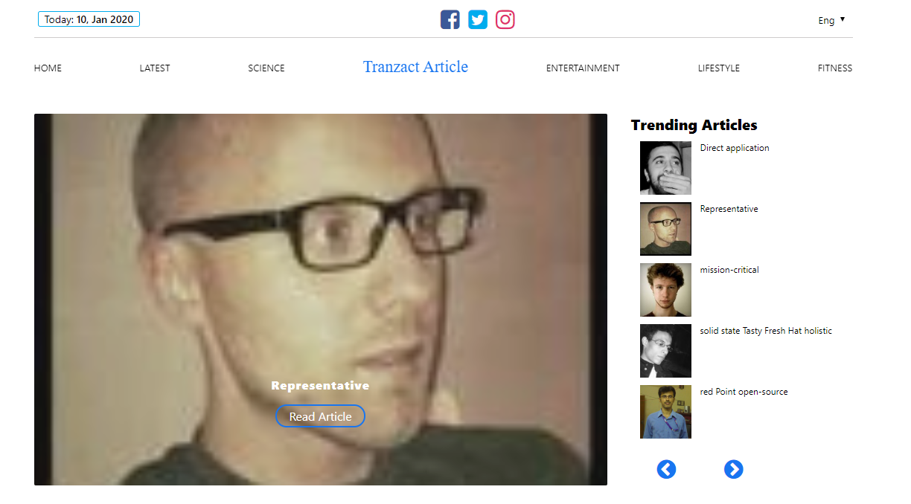
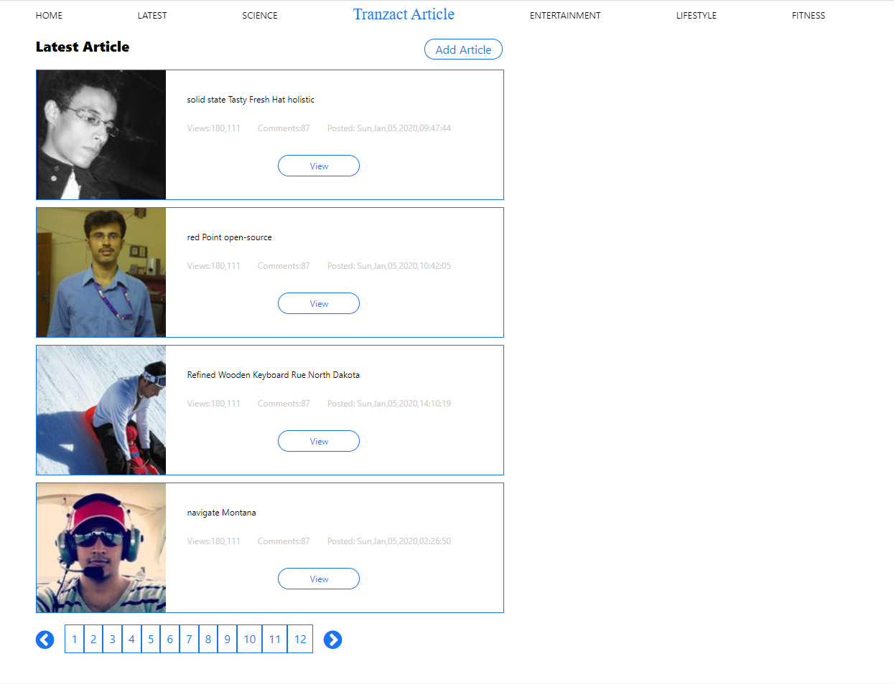
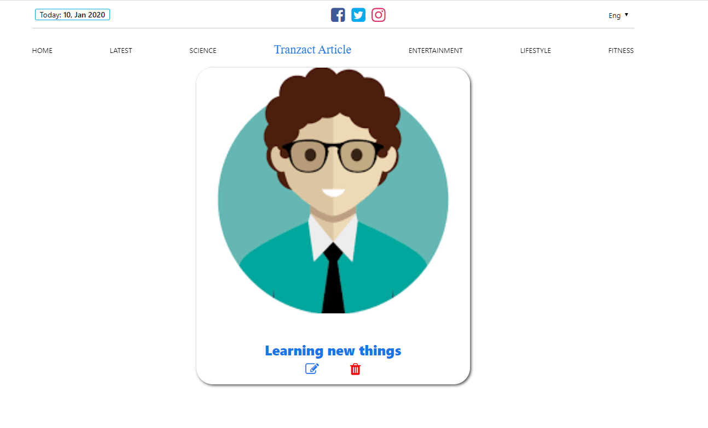
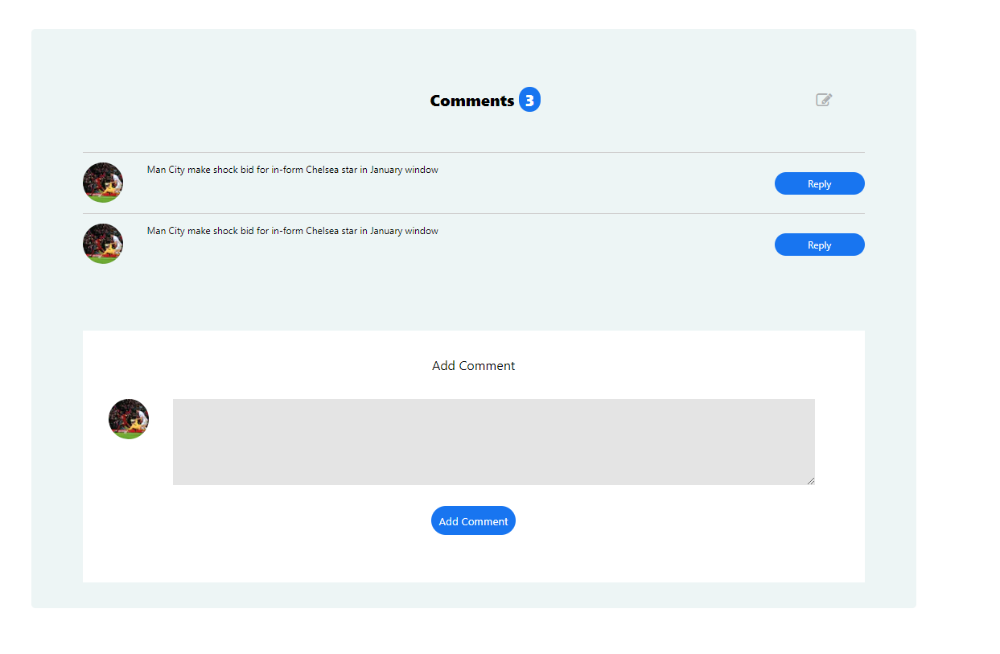
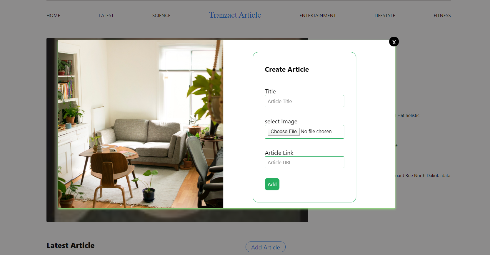

## ARTICLE

Site: [Transact Article](https://transact.netlify.com/)

Mock up build for the https://www.etranzact.com/ Frontend test. Powered by HTML, CSS and Javascript.
mock api: http://5e0df4b536b80000143db9ca.mockapi.io/etranzact/v1/article.

## Requirements

- create a simple web app using the API given to you.
- A simple landing page that would display all the article (Paginated) with a `next` and
  `back` links
- Clicking on any of the articles would display a single article in a separate page with the
  images and comments. Also add a form to add a new comment to the article.
- display the images on the article view page as a slider
- A form to Create and update article.

## Features

- RESTful API
- Modular
- Paginations
- Navbar Toggle
- Responsive Layout
- Progresive Web Application (PWA)

# Pagination

# Single Article Display

# Comments

# Modal

